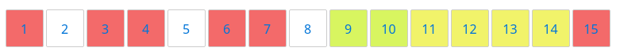
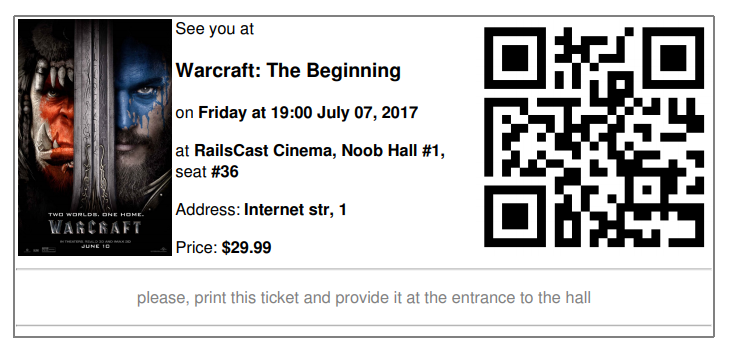

# Cinema Tickets App

An app that enables you to manage your cinemas - if you're an owner, buy a ticket - if you fancy a movie, or admin this 
whole thing - if you feel like a God.

## Technology

This app is built with ruby 2.4.1, rails 5.0.3 and utilizes Bootstrap 4 with FontAwesome icons for the web pages. 
The layout is fully compatible with any screen size. MySQL is used as a database.
 
Some of the gems that were used:

- **devise** for user profiles
- **cancancan** for authorizations
- **wicked_pdf** for pdf rendering
- **money-rails** for actions with money

and many more!

## Features

### TO DO

- autoupdates for seats' statuses (ActionCable)
- make a ticket's QR code be actually meaningful (presently, it's just for looks)
- somehow make the seats appear as they would've been in a real hall, not just in-line as they are now

### User roles

There are three groups of users: **admins**, **cinema owners** and **customers**. User can choose whether they are an 
owner or a customer upon sign up.

- **Admin**'s job is to add new movies to the list of avaliable movies, and approve new cinema owners.

- **Cinema owner** is here to sell their tickets. So they can add cinemas, halls to their cinemas and schedule 
   movie sessions with all the required info (amount of seats, price, etc). However, an owner has to recieve an approval
   from an admin first, otherwise there will be nothing for them to do, but wait.

- **Customer** (or just user) fancies a movie! So they can choose a movie from the list of available sessions and
 buy a ticket, that they'll recieve as a pdf file! Now that's modern technology!
 
### Reservations

After a user decides on a movie and picks a session to attend to, they'd want to buy a ticket. A user would click on an
available seat and it would automagically become temporarily reserved for them, so that they can finish their purchasing 
process. If after a while this user has not completed their purchase, the seat becomes available to everyone again.

The picture below shows how it looks. The white seats are available, the red ones are taken, the greenies are this 
user's temporary reservations, and yellowish ones are the other users' reservations. 

### Tickets

After a customer successfully completes their purchase they are presented with a pdf ticket for their respective seat as
a pdf file with all the required information, as shown on an image below.

## Authors

* **Oleg Larkin** - *Initial work* - [krabique48](https://github.com/krabique48) (krabique48@gmail.com)
